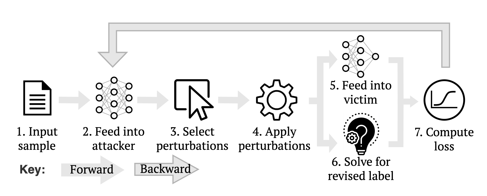

# Logically consistent AdVersarial Attacks (LAVA)



LAVA is a method for adversarially attacking soft theorem provers (STPs). Throughout this repo, the STP is the victim, and LAVA is a framework for training an attacker model to generate attacks to fool the victim. The attacks are logically consistent because they use a symbolic solver to guarantee that the label faithfully represents the logical entailment relationship after the perturbations have been applied.

Outlined below are the steps to reproduce the main results from the paper.

## Setup environment

Tested for python3.6.
- Create a fresh virtual environment
- Activate environment
```
python3 -m venv <path_to_venv>
source <path_to_venv>/bin/activate
```


- Install requirements by running the following:

```
pip install Cython
pip install pyarrow==2.0.0
pip install datasets==1.14.0
pip install OpenAttack==2.1.1
pip install -r requirements.txt
pip install -U pip
pip install tensorflow==2.0.0
pip install tensorflow-hub==0.12.0
```

## Download data

Download the data & place into the appropriate location by running the following:

```
mkdir -p data
mkdir -p logs
wget https://logically-consistent-adversarial-attacker.s3.eu-west-2.amazonaws.com/rule-reasoning-dataset-V2020.2.4.zip
unzip rule-reasoning-dataset-V2020.2.4.zip
rm -f rule-reasoning-dataset-V2020.2.4.zip
mv rule-reasoning-dataset-V2020.2.4 data/rule-reasoning-dataset-V2020.2.4
```

## Scripts

Outlined below are the instructions to replicate the results in the paper. The main_flow script is of most interest as it contains the main results of the paper so this should be (relatively) well-documented & simple to follow. The other scripts follow this script's blueprint so should also be simple to adapt as required. **Note**: the tables & figs. were produced using `lava/common/display_results.py` but will require the use to specify paths to outputs manually at the top of this file to run it.

**i)** `resources/cmds/main_flow.sh` 

The main pipeline consisting of the following stages:
1) Train the victim (& eval on the test set)
2) Train the attacker against this victim (& eval on the test set)
3) Run the attacker over the original train/test/val datasets (used to train the victim in 1.) to create predictions (adversarial examples)
4) Resume training of the victim on the augmented dataset of i) the original data & ii) the adversarial dataset from 3. Eval on the original & adversarial test sets. **Note**: we are resuming training here, using the victim weights from 1. 

The script is configured to reproduce our main results (i.e., in the paper, **Ours** in table 2 & all of table 4). This script takes 1-2 days to run on our 11Gb GPU.

Running instructions:
- Open `resources/cmds/main_flow.sh` & set the parameters within the section USER INPUT. This is where you decide which victim model you would like. Our main model uses roberta-large.

**ii)** `resources/cmds/ablate.sh`

Reproduce the ablations in table 2 in the paper. 

Running instructions:
- As for `main_flow.sh`, open the script & add inputs where marked

**iii)**  `resources/cmds/num_perturbs.sh`

Reproduce the data used to generate fig.5 in the paper.

Running instructions:

- As for `main_flow.sh`, open the script & add inputs where marked
- **Note**: due to the large number of trials, this will take a while. Probably best to parallelize across multiple machines

**iv)**  `resources/cmds/transferability.sh`

Reproduce the data used to generate table 3 in the paper. 

Running instructions:

- As for `main_flow.sh`, open the script & add inputs where marked
- This script is setup to use 2 victims, i.e. victim1 -> victim2 & victim2 -> victim1 but can easily be adapted to use only 1 victim
- Uncomment the appropriate section to reproduce the results for the HF and TF baselines

**v)** `resources/cmds/hf_tf_baselines.sh`

Reproduce the data used for the HF and TF baselines in table 2 in the paper. 

- As for `main_flow.sh`, open the script & add inputs where marked
- This script is a 2-stage process: 1) generate adversarial samples 2) re-evaluate these samples by applying the perturbation to the underlying logic program and passing this through problog to compute the modified label (i.e. run through the solver module using the paper's terminology)
- See `lava/common/display_results.py:display_attacker_results` to obtain results from the above outputs
- **Note** This takes several days to run because the HF/TF implementations are very slow

The other results from the paper can be reporduced using the remaining scripts from in `resources/cmds`.
